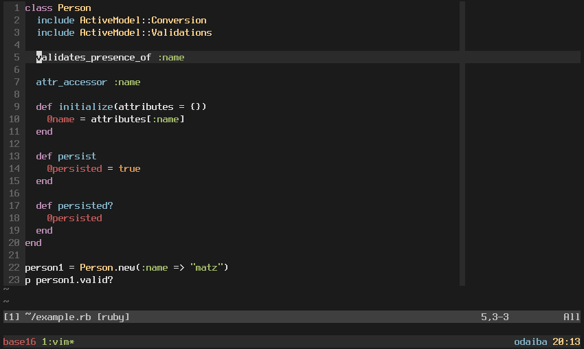

# Base16 Vim
See the [Base16 repository](https://github.com/chriskempson/base16) for more information.  
This theme was built with [Base16 Builder PHP](https://github.com/chriskempson/base16-builder-php).

Supports graphical Vim and console Vim.



## Terminal Themes
For terminal Vim (non-gui) please ensure you are using a base16 terminal theme.

* [iTerm2](base16-iterm2)

## Installation

Add `colorscheme base16-default-dark` to your `~/.vimrc`.

### Vundle
Add the following to your `~/.vimrc` file and run `PluginInstall` in Vim.

    Plugin 'chriskempson/base16-vim'

### vim-plug
Add the following to your `~/.vimrc` file and run `PlugInstall` in Vim.

    Plug 'chriskempson/base16-vim'

### Pathogen

    cd ~/.vim/bundle
    git clone https://github.com/chriskempson/base16-vim.git

### Manual

    cd ~/.vim/colors
    git clone https://github.com/chriskempson/base16-vim.git base16
    cp base16/colors/*.vim .
    
## 256 colorspace 
If using a Base16 terminal theme designed to keep the 16 ANSI colors intact (a "256" variation) **and** have sucessfully modified your 256 colorspace with [base16-shell](https://github.com/chriskempson/base16-shell) you'll need to add the following to your `~/.vimrc` **before** the colorsheme declaration.

    let base16colorspace=256  " Access colors present in 256 colorspace

This will cause vim to access the colours in the modified 256 colorspace. Please **do not** enable this simply because you have a 256 color terminal as this will cause colors to be displayed incorrectly. 

## Troubleshooting
There is a script to help troubleshoot colour issues called `colortest` available in the [Base16 Shell](https://github.com/chriskempson/base16-shell) repository.

If you are using a ISO-8613-3 compatible terminal (
[vim docs](https://github.com/vim/vim/blob/23c1b2b018c8121ca5fcc247e37966428bf8ca66/runtime/doc/options.txt#L7876),
[neovim docs](https://neovim.io/doc/user/options.html#'termguicolors')), and
you see a green or blue line, try to enable `termguicolors`:

```vim
set termguicolors
```

### Green line numbers


If your Vim looks like the above image you are using a 256 terminal theme without setting `let base16colorspace=256` in your `~/.vimrc`. Either set `let base16colorspace=256` in your `~/.vimrc` or use a non 256 terminal theme.

### Blue line numbers


If your Vim looks like the above image you are setting `let base16colorspace=256` in your `~/.vimrc` but either not running [Base16 Shell](https://github.com/chriskempson/base16-shell) or [Base16 Shell](https://github.com/chriskempson/base16-shell) is not working for your terminal. Either ensure [Base16 Shell](https://github.com/chriskempson/base16-shell) is working by running the `colortest` available in the [Base16 Shell](https://github.com/chriskempson/base16-shell) repository or not setting `let base16colorspace=256` in your `~/.vimrc`.

## Customization
If you want to do some local customization, you can add something like this to your `~/.vimrc`:

```vim
function! s:base16_customize() abort
  call Base16hi("MatchParen", g:base16_gui05, g:base16_gui03, g:base16_cterm05, g:base16_cterm03, "bold,italic", "")
endfunction

augroup on_change_colorschema
  autocmd!
  autocmd ColorScheme * call s:base16_customize()
augroup END
```
